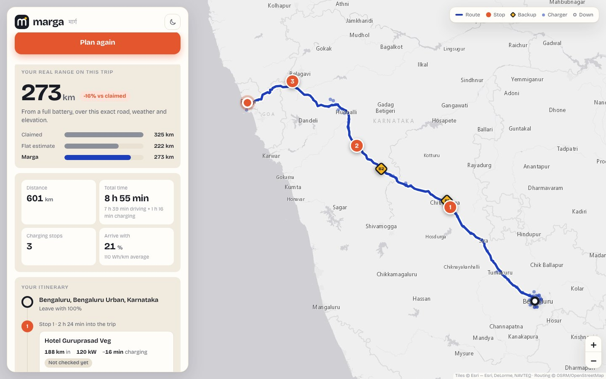

# Marga · मार्ग

**EV road trips in India that you can actually finish.**

Marga plans electric-car trips using real physics (drag, hills, wind, temperature, your driving style) instead of
brochure range, then picks charging stops, gives each one a backup, and avoids stations that are reported broken.

**Try it: https://haven.taila6d3cb.ts.net/marga/**



## What it does

- **Real range for your car and your road.** A force-balance model (air drag, rolling resistance, grade, wind,
  climate load, drivetrain and regen losses) runs over every stretch of the route using real elevation and weather.
- **~50 Indian EVs** with drag coefficient, frontal area, weight and drivetrain efficiency, all editable.
- **Charging stops with backups.** Fast stops are chosen to keep your safety buffer, and each stop has a nearby
  alternative shown in a different colour on the map.
- **Self-updating charger data.** The national charger list refreshes daily from Open Charge Map, and a daily health
  check flags stations reported down so the planner skips them.
- **A battery graph and an energy breakdown** that show exactly why the range is what it is.
- Light and dark themes, and a phone-friendly layout.

## Documentation

- [User guide](docs/USER_GUIDE.md): how to use the site, with screenshots.
- [How it works](docs/HOW_IT_WORKS.md): the architecture, the physics, and what every file does.

## Run it yourself

```bash
git clone https://github.com/Saiaarjay09/ev-copilot.git marga && cd marga
deploy/install.sh              # venv + dependencies + start-at-login service on macOS
```

Then add your keys to `.env` (see `.env.example`). `OCM_API_KEY` from
[Open Charge Map](https://openchargemap.org/site/developerinfo) is the important one: it lets the server refresh the
charger list and health data by itself. `OPENWEATHER_API_KEY` and `GEMINI_API_KEY` are optional.

For development without the service:

```bash
python3 -m venv .venv && .venv/bin/pip install -r requirements.txt
.venv/bin/python -m uvicorn server:asgi_app --port 8090 --reload   # http://127.0.0.1:8090
.venv/bin/python -m unittest discover -s tests -v
```

To publish it on the internet with [Tailscale](https://tailscale.com) Funnel: `deploy/publish.sh --public`.

## Credits

Routing by [OSRM](https://project-osrm.org) / © OpenStreetMap contributors · charger data from
[Open Charge Map](https://openchargemap.org) · maps © Esri · elevation and fallback weather by
[Open-Meteo](https://open-meteo.com) · weather by [OpenWeatherMap](https://openweathermap.org) · place search by
ArcGIS · map library [Leaflet](https://leafletjs.com) · typeface Bricolage Grotesque (SIL OFL).

Estimates are estimates: keep a margin and check a station is free before you rely on it.
