# Marga user guide

## Open the site

**https://haven.taila6d3cb.ts.net/marga/**

It works in any modern browser on a phone or a computer, and needs no sign-up or install. (It runs on a home
computer, so if it ever does not load, it may simply be switched off or offline. Try again later.)

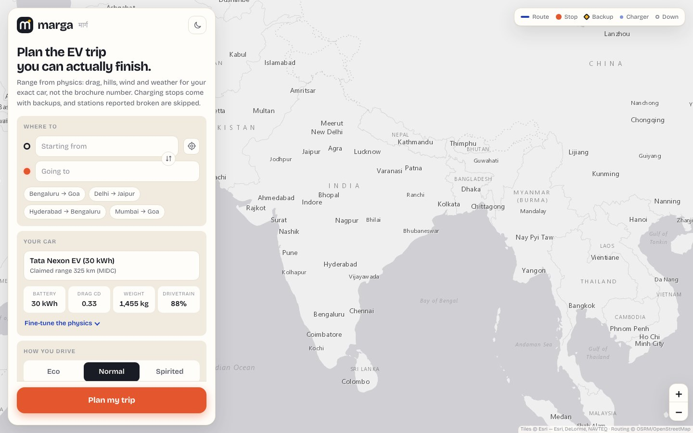

---

## Plan a trip in four steps

### 1. Say where you are going

Type a start and a destination. Suggestions appear as you type; click one, or use the **↑ ↓** keys and **Enter**.

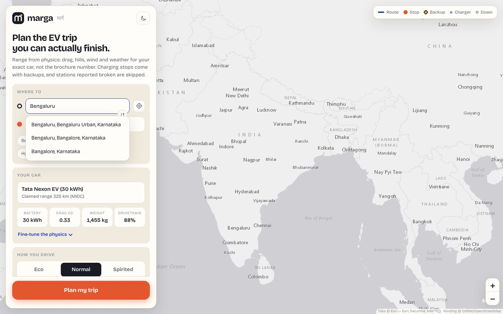

- Tap the **target icon** next to the start box to use your current location (your browser will ask permission).
- Tap the **↕ button** to swap the two places.
- Not sure what to try? Tap one of the example chips, like *Bengaluru → Goa*.

Marga plans trips within India.

### 2. Pick your car

Tap the car box and search. Marga knows about 50 electric cars sold in India, each with its real battery size and
physical details.

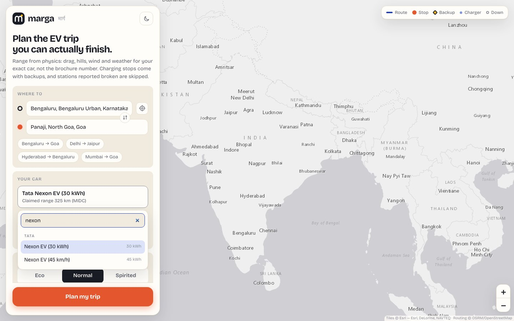

The four tiles show what the physics model will use: **battery**, **drag coefficient** (how slippery the shape is),
**weight** and **drivetrain efficiency** (how much of the battery's energy actually reaches the wheels).

**Fine-tune the physics** (optional). If your car has a bigger battery, a roof box, or you know better numbers,
open this section and adjust anything. Your changes are remembered next time.

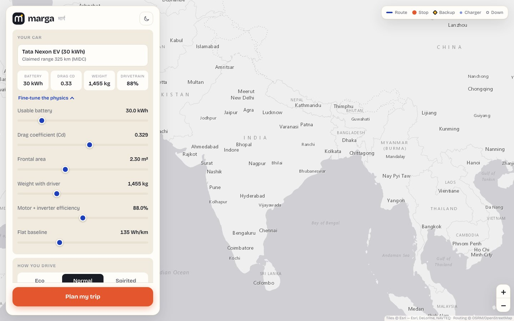

### 3. Say how you drive

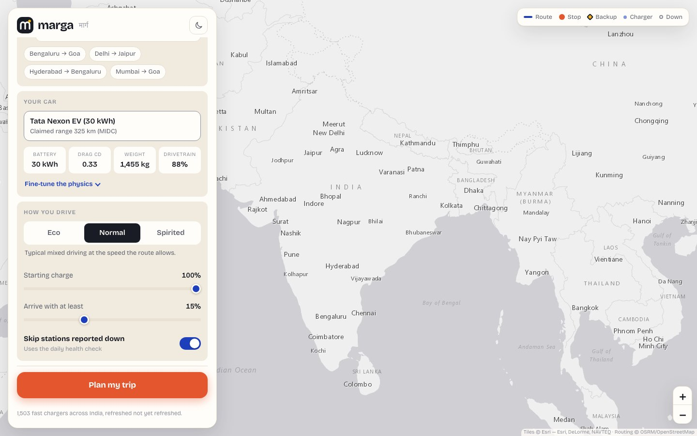

| Control | What it does |
|---|---|
| **Eco / Normal / Spirited** | Eco is smooth and gentle (about 7% less energy). Spirited is hard acceleration and late braking (about 14% more). |
| **Starting charge** | How full the battery is when you leave. Starting at 60% means earlier stops. |
| **Arrive with at least** | Your safety cushion. Marga plans stops so you never dip below this, and will only dig into it, briefly, to reach a fast charger. 15% is a sensible default. |
| **Skip stations reported down** | When on, stations that drivers or operators have flagged as not working are avoided. |

### 4. Press **Plan my trip**

Give it a few seconds. Marga finds the roads, reads the terrain and weather along them, and simulates the whole
trip.

---

## Reading your results

### Your real range on this trip

The big number is how far a **full battery** would take *your* car on *this exact road* in today's weather and
terrain. It is shown next to:

- **Claimed**: the manufacturer's brochure figure.
- **Flat estimate**: the simple "battery ÷ typical Wh/km" figure most apps use.
- **Marga**: the physics estimate for this trip.

The coloured chip says how far Marga's number is above or below the claim. A downhill route (like Bengaluru to
Goa) can beat the brochure; a hot, windy, hilly one usually will not.

Below it are the trip totals: **distance**, **total time** (driving plus charging), number of **charging stops**, and
the **charge you will arrive with**.

If you see alternative routes, tap a route chip to switch. Grey lines on the map are the alternatives, and you can
click them too.

### Your itinerary

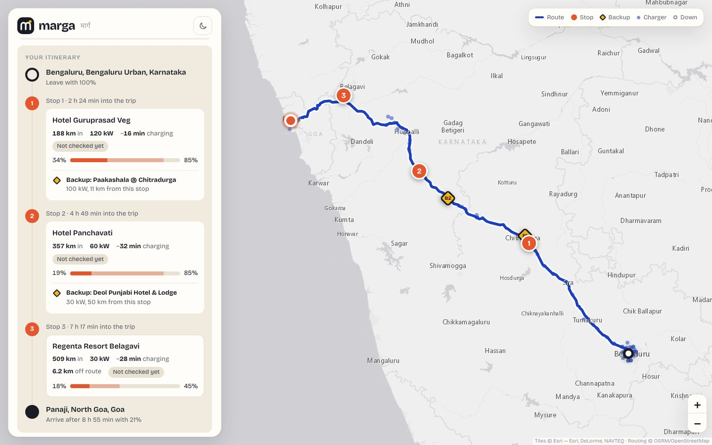

Each stop shows:

- how far into the trip it is and the charger's power,
- roughly how long you will charge,
- the battery level when you arrive and when you leave (the bar),
- a health chip: **Reported working**, **Not checked yet**, or **Flagged down**,
- a **Backup**: another charger nearby along your route, in case the first one is broken or busy.

**Tap a stop card** to fly the map to it.

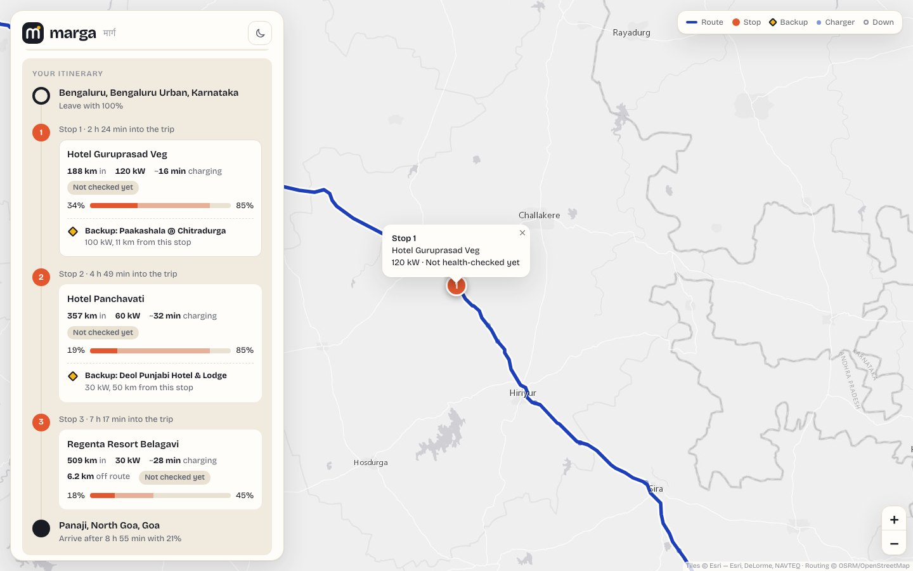

### Map symbols

| Symbol | Meaning |
|---|---|
| Blue line | Your route |
| Orange numbered circle | A planned charging stop |
| Yellow diamond (B1, B2…) | The backup for that stop |
| Small blue dots | Other fast chargers near the route |
| Hollow grey circles | Chargers flagged as possibly down |
| Black-and-white dot / orange dot | Start / destination |

### Battery and terrain

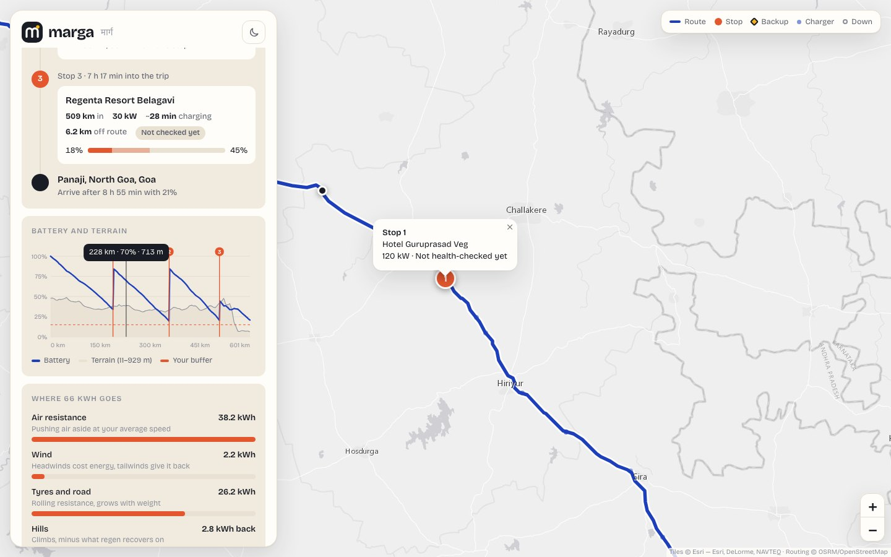

The blue line is your battery level along the trip. It jumps up at each numbered stop. The grey area is the
elevation, and the dashed line is your safety cushion. **Move your mouse (or finger) along the graph**: a dot moves
along the route on the map so you can see exactly where each part of the trip happens.

### Where your energy goes

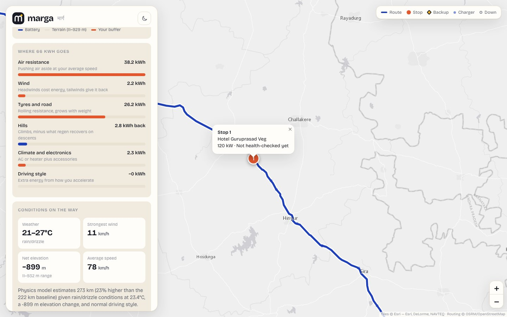

This is the "why" behind the range. It splits the trip's total energy into:

- **Air resistance**: pushing through the air at your speed.
- **Wind**: extra cost from headwinds, or savings from tailwinds.
- **Tyres and road**: rolling resistance, which grows with weight.
- **Hills**: climbing costs energy; descending gives some back ("kWh back" in blue).
- **Climate and electronics**: air-conditioning or heating.
- **Driving style**: the extra from Spirited driving (or the saving from Eco).

Underneath, **Conditions on the way** shows the weather, the strongest wind, the net elevation change and your
average speed.

### Open in Google Maps

The button at the bottom opens your trip in Google Maps with your charging stops added as waypoints, ready for
navigation on your phone.

---

## Changing your mind

Change any setting after planning (a different car, driving style, buffer...) and a bar appears saying **Settings
changed**. Press **Update plan** to re-run it instantly with the new numbers. This is a good way to see, for
example, how much time Eco driving saves.

## Dark mode

Tap the moon/sun button at the top of the panel. Marga also follows your device's setting the first time.

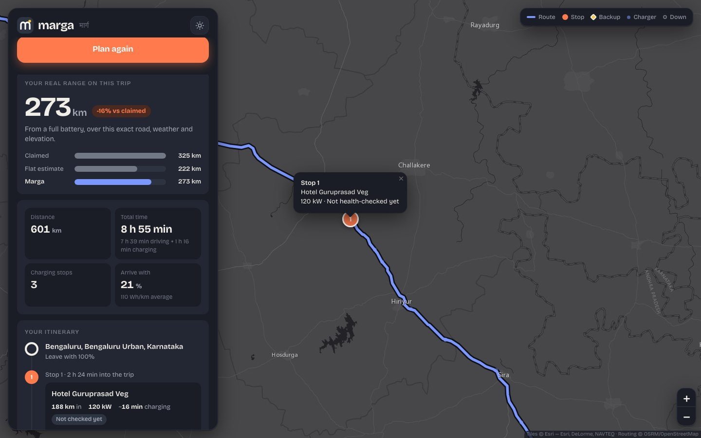

---

## On your phone

The planner becomes a sheet at the bottom of the screen. After you plan a trip it folds down to a summary bar so you
can see the map; **tap the summary (or the little handle) to open the details** again.

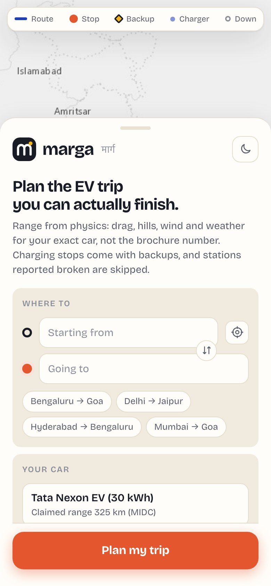
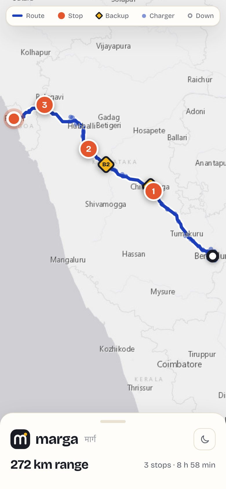
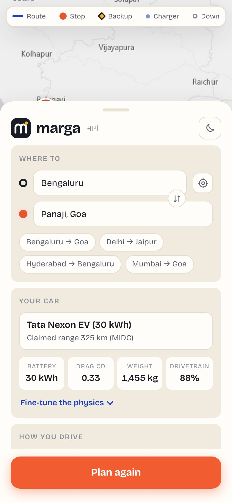

Tip: in your phone's browser menu, choose **Add to Home Screen** to keep a shortcut to Marga.

---

## When something does not work

| You see | What it means | What to do |
|---|---|---|
| *No reachable charger ahead after N km* | With your car, starting charge and buffer, there is a gap between chargers that the battery cannot bridge. | Start with a fuller battery, lower the safety buffer a little, pick another route, or plan a charge before leaving. |
| *No fast chargers are listed along this route yet* | The charger database has nothing within 10 km of the road. | Try a different route or a nearer major highway. |
| *The road-routing service is unreachable* (straight-line estimate) | The free routing service is down, so Marga can only estimate a straight line. | Wait a few minutes and try again. |
| *That route expired* | Routes are kept for an hour. | Press **Plan my trip** again. |
| *Too many requests* | You (or your network) searched very quickly. | Wait a minute. |
| Place not found | Marga only searches India. | Add the state, or try a nearby big town. |

---

## Good to know

- **Estimates, not promises.** Marga is far more realistic than a brochure figure, but weather changes, traffic
  happens, and batteries age. Keep a margin, and follow the app's buffer.
- **Charger status is inferred.** "Reported working" means the operator and recent driver check-ins do not suggest a
  problem. It cannot promise a free plug. The backup is there for a reason.
- **"Not checked yet"** means that station has not been through the daily health check (yet).
- **Your privacy.** Marga has no accounts and does not save your trips: routes are held in the server's memory
  for an hour and then discarded. Like any website, the server keeps ordinary access logs (such as your IP address and
  the pages requested). Your car and settings are saved only in your own browser. Your location is used only if you
  press the target button, and only to fill in the start box.

---

## Setting it up yourself

Developers and owners: see [HOW_IT_WORKS.md](HOW_IT_WORKS.md) for how the app works and how to run and publish it.
